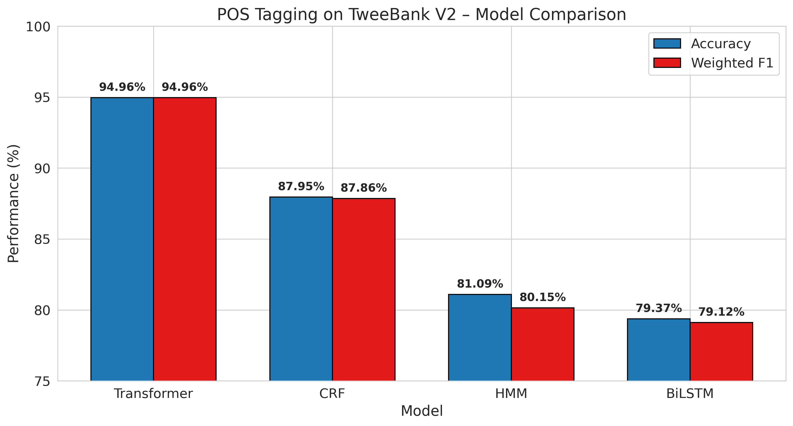
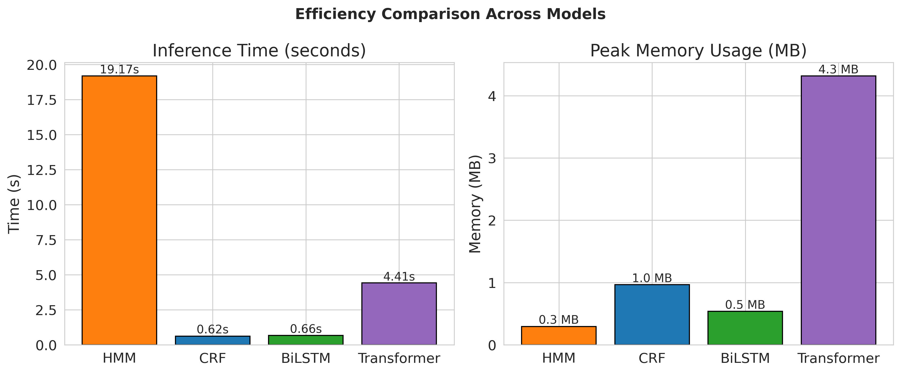
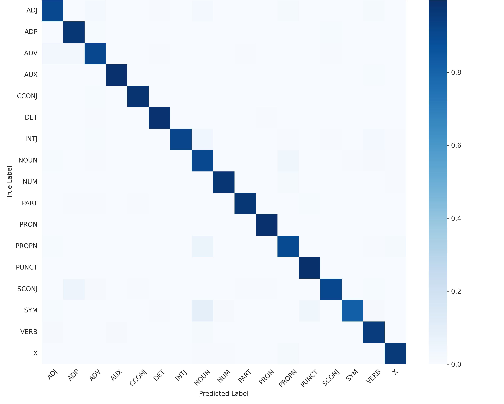

# POS Tagging on Social Media Text using HMM, CRF, BiLSTM and Transformer

---

## Overview

Part-of-Speech (POS) tagging is a fundamental task in Natural Language Processing (NLP), where each word in a sentence is assigned a grammatical label such as **NOUN**, **VERB**, or **ADJECTIVE**.

Unlike formal text, social media platforms such as Twitter contain informal language, abbreviations, emojis, user mentions, URLs, misspellings, and out-of-vocabulary (OOV) words, making POS tagging significantly more challenging.

This project presents a comparative study of four different sequence labeling approaches evaluated on the **TweeBank V2** Twitter dataset:

- Hidden Markov Model (HMM)
- Conditional Random Field (CRF)
- Bidirectional Long Short-Term Memory (BiLSTM)
- Twitter-RoBERTa Transformer

The objective is to analyze the trade-offs between prediction accuracy, computational efficiency, and robustness on noisy social-media text.

---

# 📄 Paper

**Title**

*A Comparative Study of HMM, CRF, Bi-LSTM, and Transformer Models for Part-of-Speech Tagging on Social Media Text*

**Conference**

2026 International Conference on Innovations in Computational Intelligence (ICICI)

**Publisher**

IEEE

**DOI**

https://doi.org/10.1109/ICICI68867.2026.11564867

**IEEE Xplore**

https://ieeexplore.ieee.org/document/11564867

---

# 🎯 Research Questions

This work investigates the following questions:

- **RQ1:** How do statistical, neural, and Transformer-based models compare on noisy Twitter text?

- **RQ2:** What factors contribute to the performance differences among these models?

- **RQ3:** What trade-offs exist between prediction accuracy and computational efficiency?

---

# 📊 Dataset

This project uses **TweeBank V2**, a Universal Dependencies (UD) treebank of English tweets annotated with Universal POS tags.

**Official Dataset Repository**

https://github.com/Oneplus/Tweebank/tree/dev/converted

Dataset statistics:

| Split | Sentences | Tokens |
|-------|----------:|-------:|
| Train | 1,639 | ~24K |
| Validation | 710 | ~11K |
| Test | 1,201 | ~19K |

The dataset is **not included** in this repository.

Download the following files from the official repository and place them in the project directory before running the notebook:

```text
en-ud-tweet-train.fixed.conllu
en-ud-tweet-dev.fixed.conllu
en-ud-tweet-test.fixed.conllu
```

---

# 🧹 Preprocessing

The preprocessing pipeline preserves word-tag alignment while normalizing noisy Twitter text.

The following transformations are applied:

- Normalize user mentions → `@user`
- Normalize URLs → `http://url`
- Convert emojis into text
- Compress repeated characters
- Normalize laughter expressions
- Replace infrequent words with `<UNK>` for statistical models

---

# 🏗️ Models

## Hidden Markov Model (HMM)

- Bigram Hidden Markov Model
- Laplace smoothing
- Viterbi decoding
- Lightweight statistical baseline

---

## Conditional Random Field (CRF)

Feature-based sequence labeling using:

- Word identity
- Prefixes
- Suffixes
- Capitalization
- Context features
- Beginning-of-sentence (BOS) and End-of-sentence (EOS) indicators

Implemented using **sklearn-crfsuite**.

---

## Bidirectional LSTM (BiLSTM)

Repository implementation:

- Learnable word embeddings
- Two-layer Bidirectional LSTM
- Dropout regularization
- Fully connected classifier
- Cross-entropy loss
- AdamW optimizer

---

## Twitter-RoBERTa Transformer

Fine-tuned using:

```text
cardiffnlp/twitter-roberta-base-2021-124m
```

The Transformer uses contextual embeddings together with subword tokenization, making it particularly robust for noisy social-media text.

---

# 🔬 Experimental Pipeline

```text
Load Dataset
      │
      ▼
Tweet Preprocessing
      │
      ▼
Vocabulary Construction
      │
      ▼
Train HMM
      │
      ▼
Train CRF
      │
      ▼
Train BiLSTM
      │
      ▼
Fine-tune Twitter-RoBERTa
      │
      ▼
Evaluation
      │
      ▼
McNemar Statistical Test
      │
      ▼
Visualizations
```

---

# 📏 Evaluation Metrics

Models are evaluated using:

- Accuracy
- Weighted F1-score
- Precision
- Recall
- Confusion Matrix
- Inference Time
- Peak Memory Usage

Additionally, **McNemar's Test** is used to determine whether the observed performance differences are statistically significant.

---

# 📈 Results

| Model | Accuracy | Weighted F1 | Inference Time (s) | Peak Memory (KB) |
|-------|----------:|------------:|-------------------:|-----------------:|
| Transformer | **94.96** | **94.96** | 4.41 | 4418.8 |
| CRF | 87.95 | 87.86 | **0.62** | 986.8 |
| HMM | 81.09 | 80.15 | 19.17 | **299.8** |
| BiLSTM | 79.37 | 79.12 | 0.66 | 549.1 |







---

# 📊 Statistical Significance

McNemar's Test confirms that the Transformer significantly outperforms every baseline.

| Comparison | χ² | p-value |
|------------|----:|---------:|
| Transformer vs HMM | 2204.31 | <0.001 |
| Transformer vs CRF | 891.11 | <0.001 |
| Transformer vs BiLSTM | 2536.50 | <0.001 |

---

# 💡 Key Findings

- Twitter-RoBERTa achieves the highest overall performance.
- CRF provides the strongest classical baseline with excellent efficiency.
- HMM remains interpretable and memory-efficient.
- BiLSTM captures contextual information but is constrained by the relatively small training dataset and the lack of pretrained representations.
- Contextual pretrained language models are substantially more robust for noisy social-media language.

---

# 📂 Repository Structure

```text
.
├── POS_Tagging.ipynb
├── README.md
├── requirements.txt
└── plots/
    ├── plot_comparison.png
    ├── plot_efficiency.png
    ├── plot_confusion_matrix.png
    ├── plot_bilstm_curve.png
    └── plot_transformer_training.png
```

---

# ⚙️ Installation

Clone the repository:

```bash
git clone https://github.com/<your-username>/<repository-name>.git

cd <repository-name>
```

Install dependencies:

```bash
pip install -r requirements.txt
```

---

# ▶️ Running the Project

1. Download the TweeBank V2 dataset from the official repository.
2. Place the three `.conllu` files in the project directory.
3. Open `POS_Tagging.ipynb`.
4. Run all notebook cells sequentially.

The notebook reproduces:

- Data preprocessing
- Model training
- Performance evaluation
- Statistical significance testing
- Performance visualizations
- Confusion matrix generation

---

# 📊 Visualizations

The notebook automatically generates:

- Model performance comparison
- Runtime comparison
- Memory usage comparison
- BiLSTM training curve
- Transformer fine-tuning curve
- Transformer confusion matrix

---

# 🔁 Reproducibility

This repository includes:

- Fixed random seeds
- Shared preprocessing pipeline
- Consistent evaluation metrics
- Statistical significance testing
- End-to-end implementation for all four models

---

# 📚 Citation

```bibtex
@inproceedings{bharti2026comparative,
  author    = {Ayush Bharti and Utkarsh Singh and Enjula Uchoi},
  title     = {A Comparative Study of HMM, CRF, Bi-LSTM, and Transformer Models for Part-of-Speech Tagging on Social Media Text},
  booktitle = {2026 International Conference on Innovations in Computational Intelligence (ICICI)},
  year      = {2026},
  publisher = {IEEE},
  doi       = {10.1109/ICICI68867.2026.11564867}
}
```

---

# Acknowledgements

We thank the contributors of the **TweeBank V2** dataset and the developers of **PyTorch**, **Hugging Face Transformers**, **scikit-learn**, **sklearn-crfsuite**, and other open-source libraries that made this work possible.
